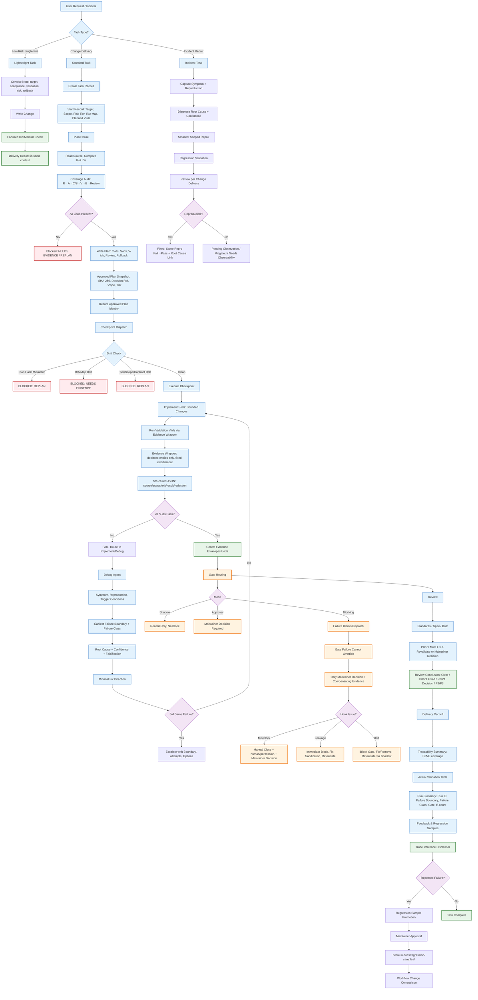

# AI Coding Workflow / Harness Pattern



## Key Artifacts & Their Locations

```
repo-root/
├── AGENTS.md                          # Entry point → task-loops.md
├── assets/closed-loop/
│   ├── task-loops.md                  # Core protocol (with Task Context Rules)
│   ├── protocols/
│   │   ├── task-record-template.md    # Start / Checkpoint / Delivery + Run Summary
│   │   ├── validation-execution.md    # Validation evidence rules per tier
│   │   ├── change-review.md           # Review Standards/Spec + P0-P3
│   │   └── regression-sample-template.md
│   └── scripts/
│       ├── check-plan-identity.mjs    # Plan hash + coverage validation
│       ├── evidence-wrapper.mjs       # Declared entries only, structured output
│       ├── workflow-probe.mjs         # Runtime fact probe
│       └── verify-*.mjs               # Doc contracts
├── docs/plans/
│   ├── <slug>.md                      # Approved plan (immutable intent)
│   └── <slug>-record.md               # Mutable progress + evidence
└── docs/regression-samples/
    └── <slug>-RS-<N>.md               # Promoted failures only
```

## Gate Enforcement Modes

| Mode | R1/R2 | R3/Security |
|------|-------|-------------|
| **Shadow** | Default for new gates (min 3 runs) | Exception only with compensating controls |
| **Approval** | After shadow validation | With approval path |
| **Blocking** | Validated gates | **Default** |

## Failure Class Taxonomy (9 Classes)

| Class | Trigger | Route |
|-------|---------|-------|
| `source/intake` | Missing/ambiguous requirement | NEEDS EVIDENCE → Explore |
| `plan/identity` | Hash mismatch, missing approval | BLOCKED → REPLAN |
| `plan/coverage` | R/A/C/S/V/E link missing | BLOCKED → NEEDS EVIDENCE/REPLAN |
| `dispatch/role` | Wrong agent, boundary violated | BLOCKED → Main Agent re-route |
| `agent/action` | Implementation defect at known boundary | FAIL → Implement (max 3) |
| `validation` | Flaky/cross-layer/env failure | FAIL → Debug |
| `review` | P0/P1 finding | BLOCKED → Repair/Decision |
| `human/permission` | Auth required, production access | BLOCKED → Maintainer Decision |
| `external/env` | Dependency/infra failure | BLOCKED → Env Owner / Tech Research |

## Risk-Proportional Gates

| Task Type | Required Gates | Conditional |
|-----------|---------------|-------------|
| Doc/No behavior | Scope/diff, manual check | Governance review |
| Logic R1 | Behavior, bounded review | TDD, independent review |
| R2 Cross-module | Behavior, regression, contract, review | Independent review, migration |
| UI | Behavior, visual (if comparable state) | Screenshot diff, human approval |
| Data/Migration | Consistency, compat, ordering, rollback | Maintainer approval, R3 security |
| Security/Privacy | SecurityAudit, explicit auth | Not autonomous, P0/P1 gate |
| Long-chain E2E | E2E, trace, failure localization | Adversarial review |